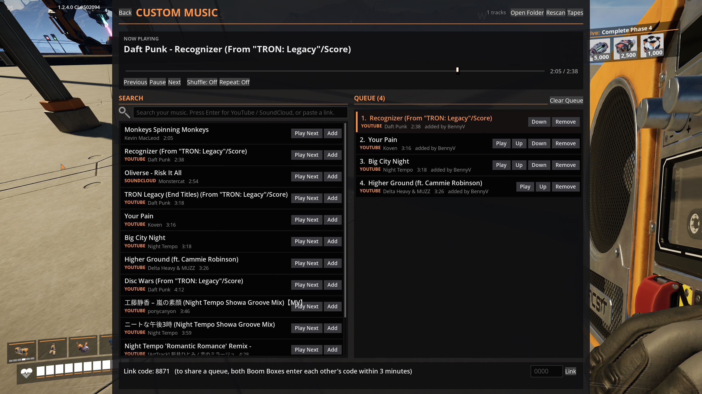
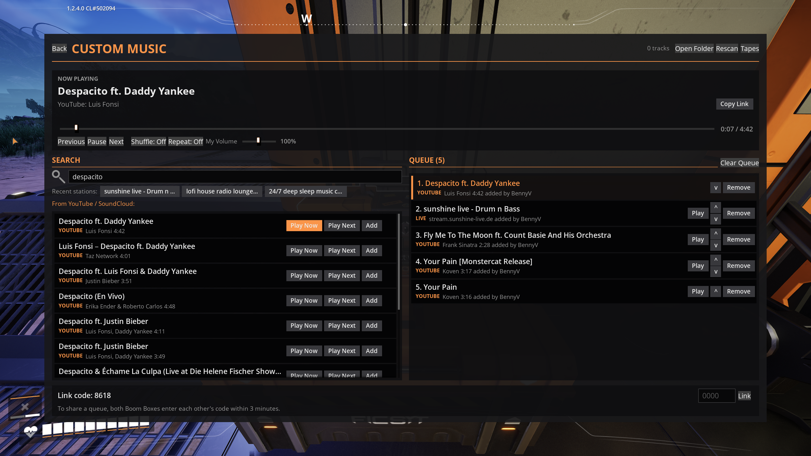
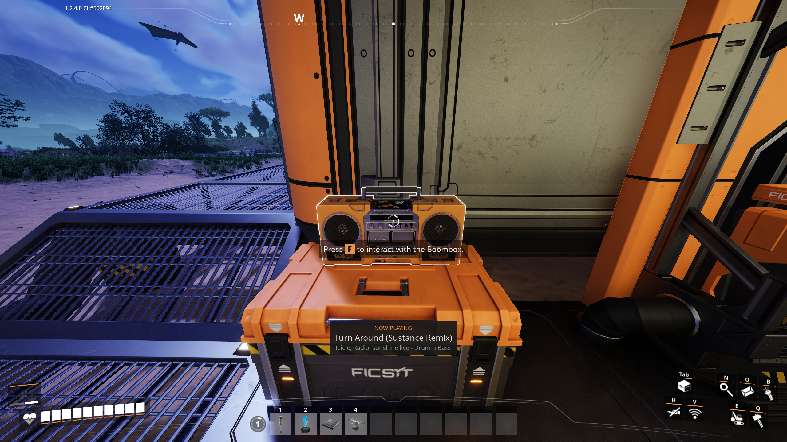
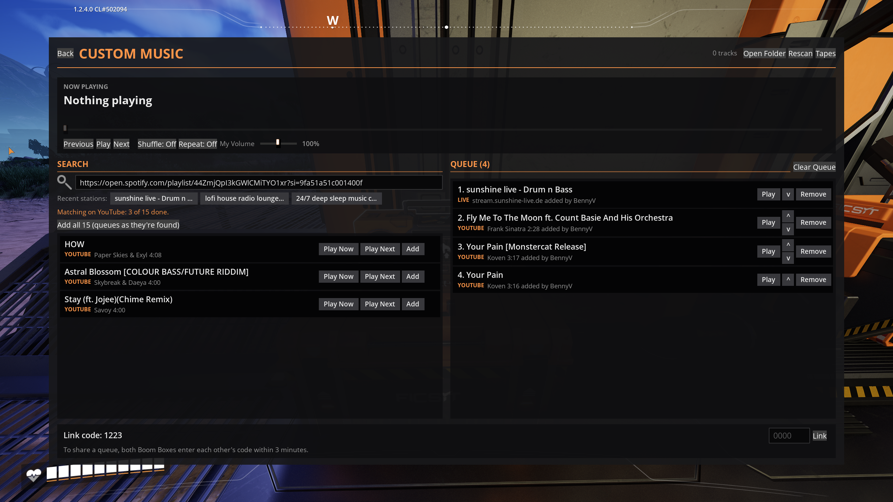
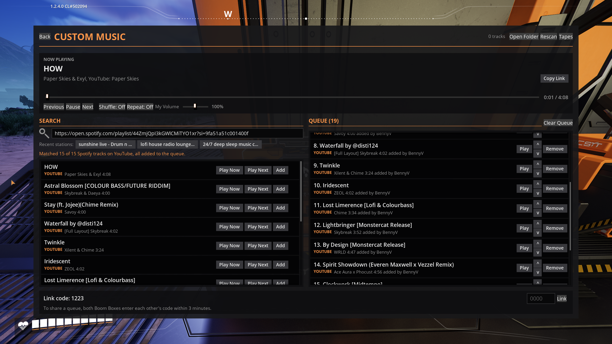
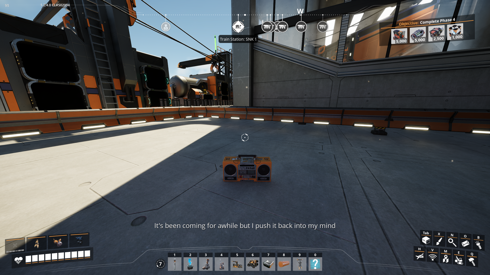
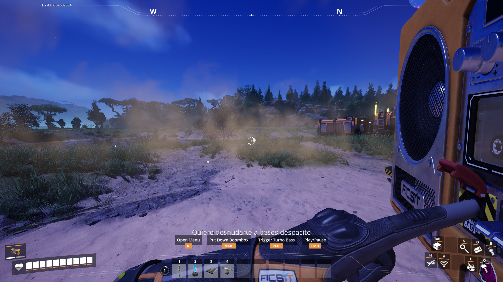
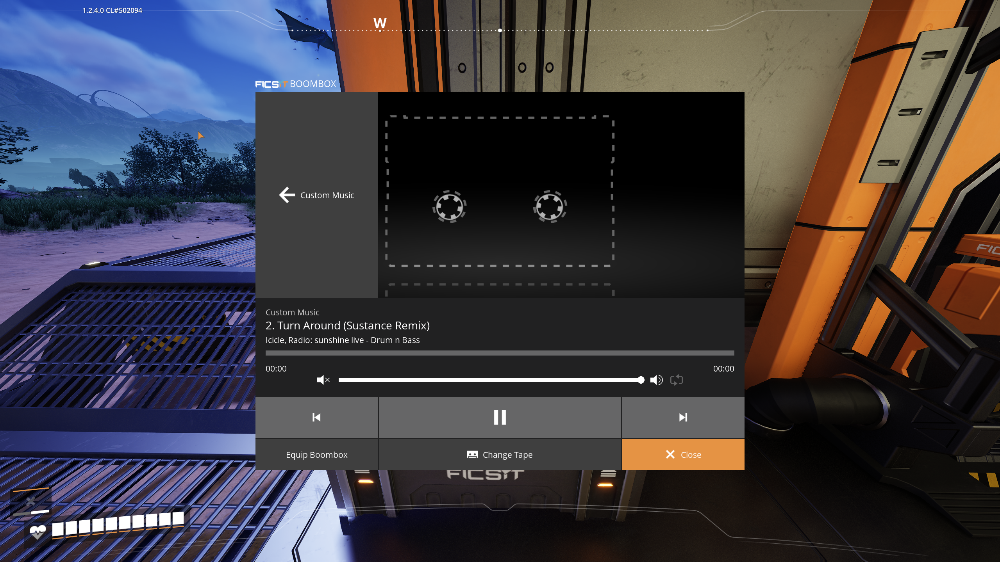
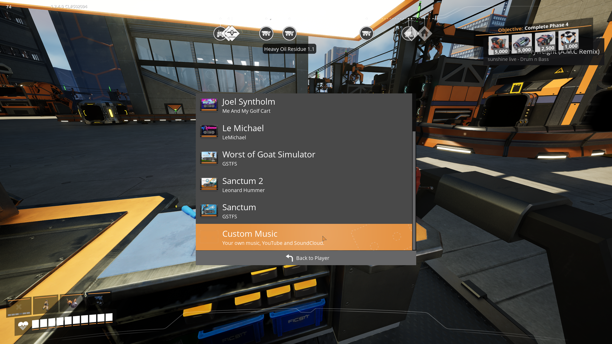
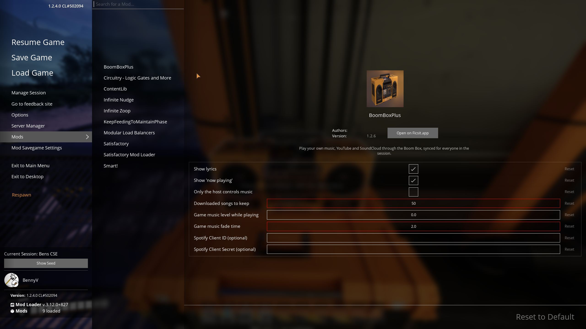

# BoomBoxPlus

A Satisfactory mod (game build 502094 / 1.2.4, SML 3.12) that makes the Boom Box play your own music,
YouTube, SoundCloud, Spotify playlists and live internet radio, synced for everyone in the session, with lyrics. Inspired by the
PEAK mod sPEAKer.

**Status:** release candidate. Tested in game on a hosted session; dedicated servers not tested yet.

- Player-facing description (ficsit.app page, settings, Spotify setup, network and AI disclosures):
  [`Docs/Release/ModPage.md`](Docs/Release/ModPage.md)
- Discord announcement: [`Docs/Release/Discord.md`](Docs/Release/Discord.md)
- Developer documentation: [`Docs/`](Docs/Architecture.md), starting with Architecture.md

## Screenshots

The Custom Music page: now playing with its source ("YouTube: Luis Fonsi"), Copy Link, the current lyric,
the seek bar, recent radio stations, the queue and the link code for sharing a queue.

Search results from YouTube and SoundCloud, each with Play Now, Play Next and Add.

The now-playing notification for a radio station: the song it announces, the artist and the station.

Pasting a Spotify playlist: songs are matched on YouTube as you watch, and **Add all** queues them as they're
found while the rest are still being matched.

The current lyric line while a Boom Box plays nearby, placed or carried.

The Boom Box's own screen following Custom Music, and the Custom Music tape in the tape list.

The settings in **Mods → BoomBoxPlus**.

## Building

1. Run `Tools/FetchTools.ps1` to download the pinned yt-dlp and FFmpeg into `Resources/Tools/` (not
   committed).
2. Build and package with Alpakit (or the `PackagePlugin` UAT command) for the `FactoryGameSteam` target.
   See [`Docs/Packaging.md`](Docs/Packaging.md).

## Credits

- Demo track: "Monkeys Spinning Monkeys" Kevin MacLeod (incompetech.com). Licensed under Creative Commons:
  By Attribution 4.0 License — http://creativecommons.org/licenses/by/4.0/
- [yt-dlp](https://github.com/yt-dlp/yt-dlp) (Unlicense) and [FFmpeg](https://ffmpeg.org) 8.1.3 (LGPL v3,
  BtbN shared build), bundled.
- Audio decoders: [dr_mp3 and dr_wav](https://github.com/mackron/dr_libs) (public domain / MIT-0),
  [stb_vorbis](https://github.com/nothings/stb) (public domain).
- Synced lyrics: [LRCLIB](https://lrclib.net).
