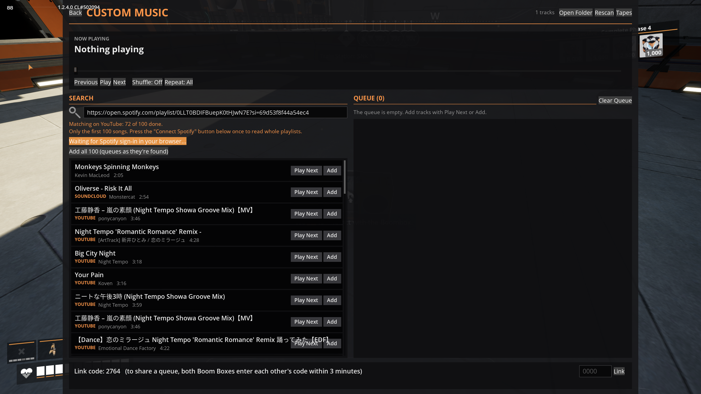
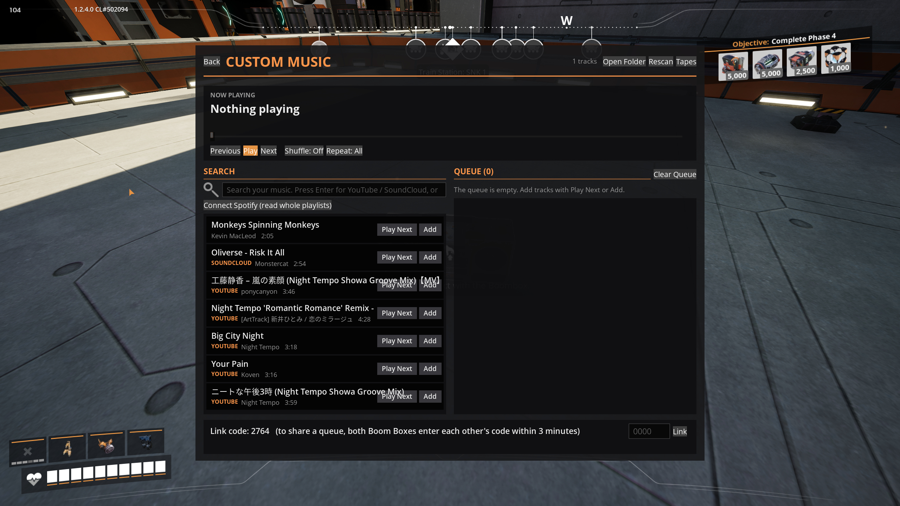

# BoomBoxPlus

A Satisfactory mod (game build 502094 / 1.2.4, SML 3.12) that makes the Boom Box play your own music,
YouTube, SoundCloud, Spotify playlists and live internet radio, synced for everyone in the session, with lyrics. Inspired by the
PEAK mod sPEAKer.

**Status:** release candidate. Tested in game on a hosted session; dedicated servers not tested yet.

- Player-facing description (ficsit.app page, settings, Spotify setup, network and AI disclosures):
  [`Docs/Release/ModPage.md`](Docs/Release/ModPage.md)
- Discord announcement: [`Docs/Release/Discord.md`](Docs/Release/Discord.md)
- Developer documentation: [`Docs/`](Docs/Architecture.md), starting with Architecture.md

## Screenshots

The Custom Music page: now playing with a seek bar, search results from your own music, YouTube and
SoundCloud, the queue, and the link code for sharing a queue.

The current lyric line while a Boom Box plays nearby.

The Boom Box's own screen with the added **Custom Music** button, next to Change Tape.

Pasting a Spotify playlist: songs are matched on YouTube as you watch, and **Add all** queues them as
they're found.

**Connect Spotify** appears once a Spotify Client ID and Secret are set in the mod settings.

## Building

1. Run `Tools/FetchTools.ps1` to download the pinned yt-dlp and FFmpeg into `Resources/Tools/` (not
   committed).
2. Build and package with Alpakit (or the `PackagePlugin` UAT command) for the `FactoryGameSteam` target.
   See [`Docs/Packaging.md`](Docs/Packaging.md).

## Credits

- Demo track: "Monkeys Spinning Monkeys" Kevin MacLeod (incompetech.com). Licensed under Creative Commons:
  By Attribution 4.0 License — http://creativecommons.org/licenses/by/4.0/
- [yt-dlp](https://github.com/yt-dlp/yt-dlp) (Unlicense) and [FFmpeg](https://ffmpeg.org) 8.1.3 (LGPL v3,
  BtbN shared build), bundled.
- Audio decoders: [dr_mp3 and dr_wav](https://github.com/mackron/dr_libs) (public domain / MIT-0),
  [stb_vorbis](https://github.com/nothings/stb) (public domain).
- Synced lyrics: [LRCLIB](https://lrclib.net).
